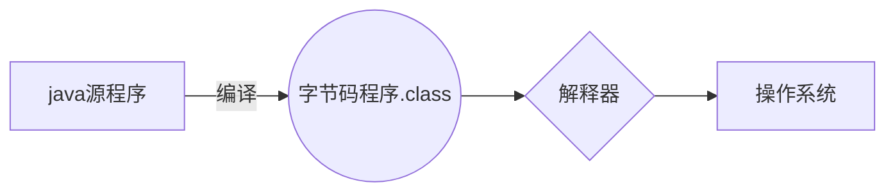
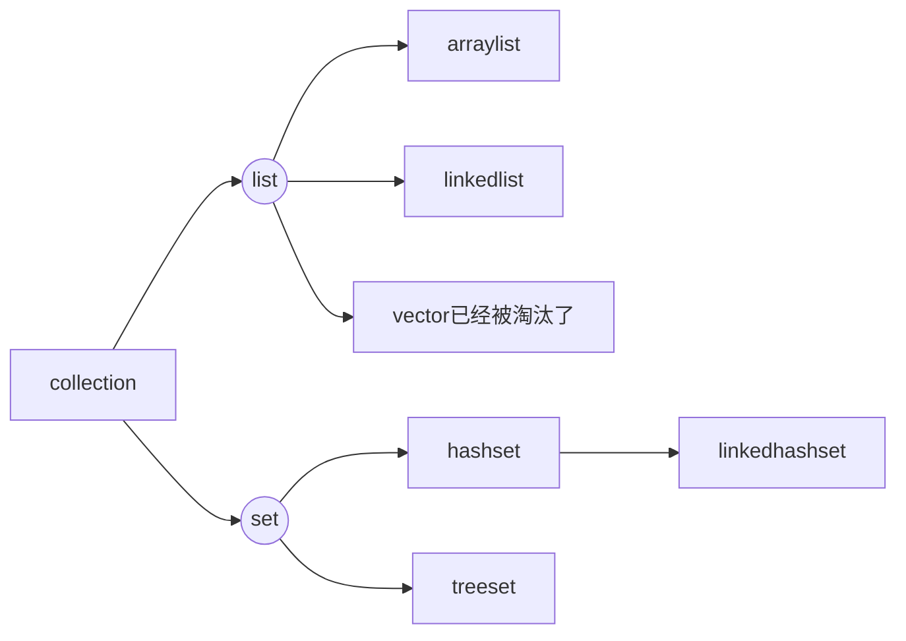
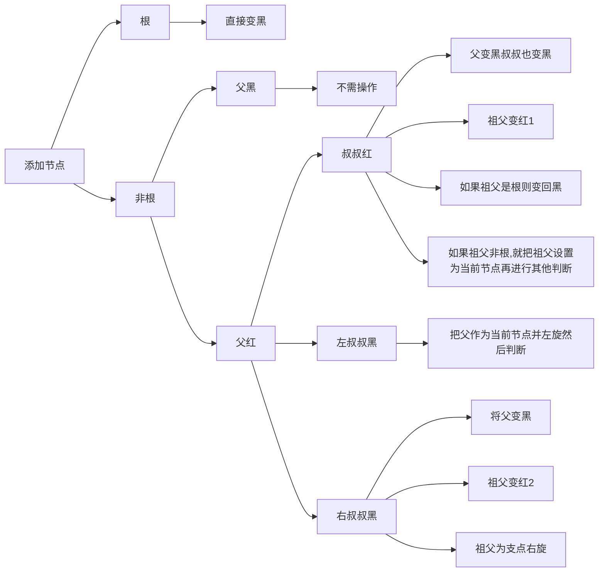
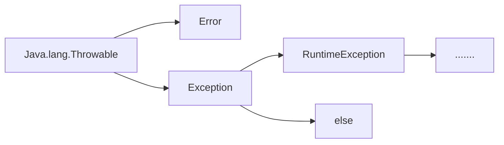

# Java

## HelloWorld

```java
public class Helloworld
{
    public static void main(string[] args)
    {
        system.out.println("HelloWorld");
    }
}
```


### **注释**

-   单行注释
-   多行
-   文档注释                                       /**               **/


### **Java变量**

-   局部变量
-   类变量（静态变量）
-   成员变量（非静态变量）


### **Java字面量**

-   整数
    -   byte
    -   short
    -   int 
    -   long 

-   小数
    -   float
    -   double
-   字符串
-   字符
    -   char
-   布尔
    -   boolean
-   空


**byte short char 运算时会直接变成int 再进行**

```java
byte result = (byte)(b1+b2);
```




### **创建对象**

```java
public class Puppy
{
    public Puppy(String name)
    {
        System.out.println("the dog's is " + name);
    }
    
    public static void main(String[] args)
    {
        Puppy myPuppy = new Puppy("Tom");
    }
}
```


### **Java常量**

`final double Pi = 3.1415926;`


使用字面量的时候，前缀0表示8进制，前缀0x表示16进制


### **自动类型转换**

低 ------------------------------------------》高

byte, short, char->int->long->float->double


**boolean类不能进行类型转换**


```java
public class Test
{
    // 成员变量
    private int instanceVar;
    // 静态变量
    private static int staticVar;
    
    public void method(int paramVar)
    {
        // 局部变量
        int localVar = 10;
        
        // 使用变量
        intstanceVar = localVar;
        staticVar = paramvar;
        
        System.out.println("成员变量" + instanceVar);
        System.out.println("静态变量" + staticVar);
        System.out.println("参数变量" + paramVar);
        System.out.println("局部变量" + localVar);
     }   
        public static void main(String[] args)
        {
            Test v = new Test();
            v.method(20);
        }
    
}
```


```java
public class Test()
{
    public static void main(String[] args)
    {
        int a = 10;
        int b = 20;
        swap(a, b);
    }
    
    public static void swap(int x, int y)
    {
        int tem = x;
        x = y;
        y = tem;
    }
}
```


### 对象内存

Java中只要没有东西指向堆空间中的某块，这块会被自动释放

也可以用`对象=NULL`


## 修饰符

### 访问控制修饰符

-   default ：同一包内可见
-   private ：同一类内可见
-   public ：所有类可见
-   protected ：同一包内的类和所有子类可见


-   父类中声明为public的方法在子类中也必须是publc
-   父类中声明为protect的方法在子类中要么声明为protected， 要么声明为public；但是不能声明为private
-   父类中声明为private的方法不能被子类继承


### final修饰符


**final 变量**

```java
public class Test
{
    final int value = 10;
    public static final int width = 6;
    static final String Title = "name";
    
    
    public void changeValue()
    {
        value = 12; // error
    }
}
```


**final 方法**

父类中的final方法可以被子类继承，但是不能重写

声明final的主要目的是防止该方法的内容被修改


**final 类**

不能被继承


### abstract

**抽象类**

不能用来实例化对象， 声明抽象类的唯一目的是为了将来对该类进行扩充

一个类不能同时被abstract 和 final 修饰

抽象类可以包含抽象方法和非抽象方法


**抽象方法**

是一种没有任何实现的方法， 该方法的具体实现由子类提供

抽象方法不能被声明为final 和 static

任何继承抽象类的子类必须实现父类中所有抽象方法，除非子类是抽象类

如果一个类包含若干个抽象方法，那么该类必须声明为抽象类。

抽象类可以不包含抽象方法

抽象方法的声明以分号结尾


```java
public abstract class SuperClass
{
    abstract void m();
}

class SubClass extends SuperClass
{
    void m()
    {
        
    }
}
```


### transient

序列化的对象包含被transient修饰的示例变量时，Java虚拟机跳过该特定变量

该修饰符包含在定义变量的语句中，来预处理类和变量的数据类型

`public transient int limit = 55;// 不会持久化`

`public int b; // 持久存在`


### volatile

修饰的成员变量在每次被线程访问时，都强制从共享内存中重新读取该成员变量的值。

成员变量发生变化时，会强制线程将变化值回写到共享内存

在任何时刻，两个不同的线程总是看到某个成员变量的同一个值

volatile对象引用可能是null

```java
public class My implements Runnable
{
    private volatile boolean active;
    public void run()
    {
        avtive = true;
        while(active)
        {
            //
        }
        
    }
    
    public void stop()
    {
        active = false;
    }
}
```


## 运算符

### 位运算

使用于：int    long	short	char	byte

a = 60      b = 13

==A = 0011 1100==

==B = 0000 1101==

-----------------------------

A&B = 0000 1100                                都是1则1，不是为0

A|B = 0011 1101								都是0为0， 不是为1

A ^ B = 0011 0001							相同为0 ， 否则为1

~A = 1100 0011									取反

<<																左移

\>>															右移

\>>>																	右移补零


### 短逻辑

```java
int a = 5
boolean b = (a<4)&&(a++<10);
```


得到：b = false

a = 5

前边正确才执行判断后面

**如果前边已经能够确定整个东西的值，则不再继续运算**

又称为短路逻辑运算符


### instanceof

```java
String name = "Tom"
boolean result = name instanceof String;
```


result = true


```java
class Vehicle{}

public class Car extends Vehicle
{
    public static void main(String[] args)
    {
        Vehicle = new Car();
        boolean result = a instanceof Car;
        system.out.println(result);
    }
}
```


### 优先级

| 类别   | 操作符               | 关联性 |
| ------ | -------------------- | ------ |
| 后缀   | ()[].                | ->     |
| 一元   | expr++expr--         | ->     |
|        | ++expr--expr + - ~ ! | <-     |
| 乘性   | */%*                 | ->     |
| 加性   | +-                   | ->     |
| 位移   | >> >>> <<            | ->     |
| 关系   | > >= < <=            | ->     |
| 相等   | == !=                | ->     |
|        | &                    | ->     |
|        | ^                    | ->     |
|        | \|                   | ->     |
|        | &&                   | ->     |
|        | \|\|                 | ->     |
|        | ?:                   | <-     |
| 赋值类 | =                    | <-     |
|        | ,                    | ->     |


## 循环

### Java增强for循环

`for(声明：表达式){}`

声明：新的局部变量，类型必须与数组元素相同

表达式：访问的数组名

```java
public class Test
{
    public static void main(String[] args)
    {
        int []numbers = {10, 20, 30, 40, 50};
        for(int x: numbers)
        {
            System.out.print(x);
            System.out.print(",");
        }
        
        
        System.out.print("\n");
        
        
        String []names = {"Jams", "Larry", "Tom", "Lacy"};
        for	(String name: names)
        {
            System.out.print(name);
            System.out.print(",");
        }
    }
}
```


## Number&Math

```java
public class Test{
    public static void main(String[] args){
       	System.out.println("90度的正弦值：" + Math.sin(Math.PI/2));
        System.out.println("0度的余弦值：" + Math.cos(0));
        System.out.println("60度的正切值：" + Math.tan(Math.PI/3));
        System.out.println("1的反正切值：" + Math.asin(1));
        System.out.println("Π/2的角度值：" + Math.PI);
    }
}
```


```java
public class Main{
    public static void main(String[]args){
        double[] nums = {1.4, 1.5, 1.6, -1.4, -1.5, -1.6};
        for(double num: nums){
            test(num);
        }
    }
    
    
    private static void test(double num)
    {
        System.out.println("Math.floor("+num+")=" + Math.floor(num));
        System.out.println("Math.round("+num+")=" + Math.round(num));
        System.out.println("Math.ceil("+num+")=" + Math.ceil(num));
    }
}
```


>Math.floor(1.4)=1.0
>Math.round(1.4)=1
>Math.ceil(1.4)=2.0
>Math.floor(1.5)=1.0
>Math.round(1.5)=2
>Math.ceil(1.5)=2.0
>Math.floor(1.6)=1.0
>Math.round(1.6)=2
>Math.ceil(1.6)=2.0
>Math.floor(-1.4)=-2.0
>Math.round(-1.4)=-1
>Math.ceil(-1.4)=-1.0
>Math.floor(-1.5)=-2.0
>Math.round(-1.5)=-1
>Math.ceil(-1.5)=-1.0
>Math.floor(-1.6)=-2.0
>Math.round(-1.6)=-2
>Math.ceil(-1.6)=-1.0


## Character

```java
char ch = 'a'
// Unicode 字符表示形式
char unichar = '\u039A';
// 字符数组
char[] charArray = {'', '', ''};

// 原始字符'a’装箱到character对象ch中
Character ch = 'a';

// 原始字符‘x'用test方法装箱
// 返回拆箱的值到'c'
char c = test('x');
```


## String

-   使用直接赋值的方式获取字符串对象：`String s1 = "abc"`

-   使用new的方式来获取一个字符串对象

空参构造，可以获取一个空白的字符串对象

`String2 = new String()`

-   传递一个字符串，根据传递的字符串内容再创造一个新的字符串对象

`String s3 = new String ("abc")`

-   传递一个字符数组，根据字符数组的内容再创建一个新的字符串对象

    `char[] chas = {'a', 'b', 'c'};`

    `String s4 = new String (chs);`

    此构造用以修改字符串的内容

-   传递一个字节数组，根据字节数组的内容再创建一个新的字符串对象

​	`byre[] bytes = {97, 98, 99, 100};`

`	String s5 = new String(bytes);`

以后在网络上传输的信息一般都是字节信息，一般转化成字符串，用此构造


当使用双引号直接赋值，系统会检查该字符串在串池中是否存在，不存在就创建，存在就复用

而手动new出来的不会复用，如果重复较多会浪费内存


```java
public class StringDemo
{
    public static void main(String args[]){
        String site  = "thereisaboycoding";
        // 计算长度
        int len = site.length();
        System.out.println(len);
    }
}
```


```java
public class StringDemo
{
    public static void main(String args[]){
        String site  = "thereisaboycoding";
		// 连接字符串
        System.out.println(site+"cool");
        
        // 不常用的
        site.concat("cool");
    }
}
```


### **格式化字符串**

```java
System.out.printf("your age is" +"%d", age);
```


### 字符串的比较

string s1 =  "abc"//串池

string s2 = new String("abc"),堆空间

s1    !=        S2


**==号**

对于基本数据类型，比较的是数据值

而如果是引用数据比较的是地址值


**正确的比较方式**

boolean equals()

boolean equalsIgnoreCase()// 忽略大小写

如：

`username.equals(rightusername)`


**键盘录入的abc和直接赋值的abc不一样**

键盘录入的类似于new出来的

### 遍历字符串


```java
for(int i = 0;i<str.length();i++){
    char c = str.charAt(i);//获取索引为i的字符
    system.out.println(c);
}
```


### 截取字符串

包头不包尾

`String substring(int beginindex,int endindex)`

`String substring(int beginindex)`

###  替换

`String replace(old,new)`


## StringBuffer和StringBuilder

就是容器，创建了后内容可以变化，适用于提高字符串操作效率


```java
public class Test{
    public static void main(Strings[]args){
        StringBuilder sb = new StringBuilder(10);
        sb.append("Hello..");
        System.out.println(sb);
        sb.append("!");
        System.out.println(sb);
        
        sb.insert(8, "Java");
        System.out.println(sb);
        
        sb.delete(5, 8);
        System.out.println(sb);
        
        sb.reverse();
        System.out.println(sb);
        
        System.out.println(sb.length);
        
        String st = sb.toString()
        System.out.println(st);
        
    }
}
```


## Stringjoiner

更简单的东西

但是市场上很少人使用


```java
public class Test{
        public static void main(String[] args) {
        int[] arr = {1, 2,3};
        StringJoiner sj = new StringJoiner(",", "[", "]");
        for (int i = 0; i < arr.length; i++) {
            sj.add(arr[i]+"");
        }
        System.out.println(sj);
    }
}
```


`public stringJoiner(间隔号)`

`public StringJoiner(间隔号，开始，结束)`

## 字符拼接底层原理

-   如果没有变量参与都是字符串的直接相加，编译后就是拼接后的结果，会复用串池中的字符串
-   有变量参与，每一行拼接的代码都会在内存中创建新的字符串，浪费内存


## StringBuilder分析

默认容量16

如果多了，会*2+2=34

还多，会以实际为准，也就是容量=长度


查看容量sb.capacity()不是size


## 集合

这个类的底层做了处理，直接打印 就是内容，不是地址值，前后以【】包括

主要方法：增删改查

```java
import java.util.ArrayList;

public class Test1 {
    public static void main(String[] args) {
        ArrayList<String> list = new ArrayList<>();

        list.add("aaa");
        list.add("bbb");
        list.add("ccc");


        boolean result = list.remove("aaa");

        String a = list.remove(0);

        String result2 = list.set(1,"ddd");// 会覆盖

        String s = list.get(0);

        for (int i = 0; i < list.size(); i++) {

            System.out.println(list.get(i));
        }

        System.out.println(result);
        System.out.println(a);
        System.out.println(result2);
        System.out.println(s);
        System.out.println(list);
    }


}
```


如果要加入Int等类型

需要使用他们原来的包装类


也可以自定义类型：

**注意啊：在添加前集合的容量为0000000**


## 标准JavaBean

私有化成员变量

空参构造方法

带全部参数的构造方法

get,set方法

## 工具类

私有化构造方法！不能让外界创造对象，因为它没有意义


## 重写

当父类中的方法不能满足子类目前需求，需要重写

重写的方法上面一行要加上@override

用以检验重写语法是否正确		


子类重写父类方法，访问权限必须大于等于父类


返回值类型必须小于等于父类


-   建议尽量和父类保持一致


私有方法不能被重写

​                                                                                   -   这两点的本质就是只有被添加到虚方法表的方法才能被重写

子类不能重写父类的静态方法


## 数组

应当首选`String[] args;`类似的方式， 尽量不使用C++ 的风格

```java
public class Test{
    public static void main(String[] args){
        int size = 10;
        double[] myList = new double[size];
        myList[0] = 5.6;
        myList[1] = 6.6;
        double total = 0;
        for(int i = 0; i<size; i++){
            total += myList[i];
        }
        System.out.println(total);
    }
}
```


```java
for(int i = 0; i<myList.length; i++){
	System.out.println(myList[i]);
}
```

```java
printArray(new double[]{1.9, 2.9, 3.9, 4.9});
```


```java
public class Test{
    public static void main(String[] args){
        double[] myList = {1.9, 2.9, 3.9, 4.9};
        for(double element:myList){
            System.out.println(element);
        }
    }
}
```


>   public static int binarySearch(Object[] a, Object key)
>
>   二分查找算法搜索给定值的对象，调用前必须排好序，找到返回索引，否则（-（插入点）-1）
>
>   public static boolean equals(long[] a, long[] a2)
>
>   俩个long型数组以相同顺序包含相同元素则true， 适用于其他类型
>
>   public static void fill(int[] a, int val)
>
>   将指定的in值分配给int数组指定范围内的元素，适用于其他类型
>
>   public static void sort(Object[] a)
>
>   升序排序


## 日期时间


获取当前日期时间

```java
import java.util.Date;

public class DateDemo{
    public static void main(String[] args){
        Date date = new Date();
        
        System.out.println(date.toString());
    }
}
```


## 正则表达


## Java方法

是语句的合集

命名规则：

-   方法的名字的第一个单词应该小写字母开头，后边的单词则用大写字母开头写，不适用连接符
-   下划线可能出现在junit测试方法名称中用以分隔名称的逻辑组件，


`修饰符+返回值类型+方法名+（参数列表）`


## 静态Static

静态变量：

-   该类所有对象共享
-   与对象无关，加载优先于对象


-   类名调用（推荐
-   对象调用


静态方法

-   多用在测试类工具类中
-   JavaBean中很少用

## 继承

构造方法         无论怎样都不能使用

成员变量       非私有能，私有能，但是不能用

成员方法        非私有能，私有不能

​						如果能加载在虚方法表内则可以


继承中，成员变量就近原则，如果加this。表示子类中的，如果加super表示父类的，不能调用爷爷的哦


子类所有的构造方法会默认先访问父类的无参构造再执行

子类构造方法中第一行必须是super（）

有时是this()表示调用本类的构造一般用以设置默认


## 可变参数

```java
public class VarargsDemo{
    public static void main(String[]args){
        printMax(34,3,3,2,56.5);
        printMax(new double[]{1,2,3});
    }
    
    public static void printMax(double...numbers){
                    if (numbers.length == 0){
                System.out.println("noargumentpassed");
                return;
            }
            
            double result = numbers[0];
            
            for (int i = 1; i< numbers.length;i++){
                if (numbers[i]>result){
                    result = numbers[i];
                }
            }
            System.out.println(result);
    }
}
```


## 多态

同类型的对象，表现出不同的形态


由父类引用指向子类对象，和c++一模一样


多态调用成员的特点

-   变量：编译看左边，运行看左边
-   方法：编译看左边，运行看右边


父类中没有这个成员，**直接编译失败**


### 多态的优势和弊端


-   右边对象可以实现解耦合，便于扩展维护

​			即业务逻辑发生变化，只要改指向不用改后续代码

-   定义方法时候，使用父类型做参数，可以接收所有子类对象，实现多态的扩展性和便利

​	


弊端

-   不能调用子类的特有功能

因为在编译的时候看父类有没有这个成员，显然，子类特有的在父类中不存在

解决：可以使用（）强制转换


当然，这里不能瞎转换

这里有个好东西

```java
if(a instanceof Dog){
    Dog d = (Dog) a;
    d.lookHome();
}else if (a instanceof Cat){
    Cat c = (Cat)a;
    c.catchMouse();
}else{
    sout("meiyou");
}
```

新版的好东西


```java
if(a instanceof Dog  d){
    
    d.lookHome();
}else if (a instanceof Cat  c){

    c.catchMouse();
}else{
    sout("meiyou");
}
```

相当于连起来了


## 包   final 权限修饰符   代码块


### 包

就是文件夹，用来管理不同功能的Java类，方便后期代码维护

**包命名规则：** 公司域名反写+包的作用，全部英文小写，

当使用其他类时，需要使用全类名


使用其他类的规则 ：

-   同一个包里的类不需要导包
-   Java。lang包中的类不需要导包
-   其他情况都要
-   如果使用两个包中的同名类，需要全类名，因为不然不知道去哪找


### final

表示该修饰的方法，类，变量是最终方法，不能被重写


final修饰的变量是基本类型，数据值不能改变

final修饰的变量是引用类型，地址值不能改变，但是对象内部可以改变


### 权限

private<              < protected <public


| 修饰符    | 同一个类 | 同一个包中其他类 | 同一个包下的子类 | 不同包下的无关类 |
| --------- | -------- | ---------------- | ---------------- | ---------------- |
| private   | Y        |                  |                  |                  |
|           | Y        | Y                |                  |                  |
| protected | Y        | Y                | Y                |                  |
| public    | Y        | Y                | Y                | Y                |


一般只用pirvate和public

一般情况成员变量都私有

方法公开

如果方法中的代码是抽取其他方法中共性代码，这个方法一般也私有


### 代码块


**局部代码块**

方法里的单独的代码


**构造代码块**

构造方法中的相同部分，可以拿出来放在成员中，执行优先于构造方法


因为太死板了，一般不用

而是使用放在全变量的方法中，空参的用this调用赋予默认值


**静态代码块**


就是在构造代码块的前面加上static

随着类的加载而加载，并且自动触发，**只执行一次**

用以在类加载 的时候做一些变量初始化


## 抽象类抽象方法

子类必须重写，和c++一模一样


类中存在抽象方法，这个类必须声明为抽象类


public abstract 返回值 方法名（）

public abstract class 类名{}


抽象类不能实例化


抽象类不一定有抽象方法

有抽象方法一定是抽象类

抽象类可以有构造方法	

​									创建子类对象时对属性进行赋值

抽象类的子类要么重写所有抽象方法

​												要么子类也是抽象类


## 接口


就是一种规则

是对行为的抽象，

抽象类更多用于父类中，而接口侧重于行为，是对行为的抽象


`public interface 接口名{}`

接口不能实例化

接口与类是实现关系，通过implements关键字表示

public class 类名 implements 接口名{}

接口的子类也叫实现类

在实现类中，要么重写接口的所有抽象方法，要么是抽象类


接口和类是实现关系，可以多实现

实现类可以在继承一个类的同时实现多个接口


### 接口成员的特点

-   成员变量

    只能是常量

​		默认修饰符public static final

-   构造方法

​		没有构造方法

-   成员方法

​		只能是抽象方法（旧版)

​	默认修饰符public abstract

新版：接口中可以定义有方法体的方法

接口中可以定义私有方法


### 接口与类的关系

-   类和类关系

继承，只能是单继承，不能多继承，但 可以多层继承

-   类和接口的关系

实现关系，可以单实现，也可以多实现，还可以在继承一个类的同时实现多个接口     ，多个接口中重名的方法重写一次就好了 

-   接口和接口的关系

继承，可以单继承，也可以多继承


### jdk8以后新增的方法

如果接口改变，添加新的规则，那么所有调用的都会报错

改进

-   **允许在接口中定义默认方法，需要使用关键字default修饰**

解决接口升级问题

public default 返回值 方法名（参数）


-   默认方法不是抽象方法，所以不强制重写，但是如果被重写，重写的时候要去掉default关键字

-   public是默认可以省略，default不能省略
-   如果实现了多个接口，多个接口中存在相同名字的默认方法，子类必须重写


-   **允许在接口中定义 静态方法**


public static 返回值  方法名


-   只能通过接口名调用，不能通过实现类或者对象名调用
-   public可以省略，static不能

-   静态方法不能重写，如果有，只是重名，用名调用会发现不同


**私有方法**

只为inter接口提供服务，不需要外类访问的方法


`private void show()`

`private static void method()`


### 接口应用

-   接口代表规则，是行为的抽象，想让哪个类有一个行为，就让这个类实现对应的接口就可以了
-   当一个方法的参数是接口时，可以传递接口所有实现类的对象，这种方法称之为接口多态

### 适配器设计模式

设计模式是一套被反复使用，多数人知晓的，经过分类编目的、代码设计经验的总结


使用设计模式是为了可重用代码，让代码更容易被他人理解、保证代码的可靠性、程序的重用性


简单理解：设计模式 就是各种套路


适配器，说白了 就是再来一个抽象类，调用要调用的接口，在这个类中重写必须重写的东西，可以空实现，然后让原来的类继承这个类就行了

一般这个适配器类名字是接口名+Adapter


如果原来的类有了继承，可以把这个继承也写到适配器使用间接继承


## 内部类


类的五大成员：属性、方法、构造方法、代码块、内部类


 **内部类**

在一个类里边再定义一个类


就是类的嵌套，不用再声明罢了


内部类可以直接访问外部类的成员，包括私有

外部类要访问内部类的成员必须创建对象


B类表示的事物是A类的一部分，且B单独存在没有意义，可以把B设计成内部类


### 成员内部类

再成员位置，属于外部类的成员

地位 和成员一样，可以被修饰符修饰

```java
public class Car{
    String carName;
    int carAge;
    int carColor;
    class Engine{
        String engineName;
        int engineaAge;
    }
}
```

Jdk16后可以再内部类中定义静态变量

获取成员内部类的对象：

-   再外部类中写方法对外提供内部类的对象

```java
public class Car{
    String carName;
    int carAge;
    int carColor;
    class Engine{
        String engineName;
        int engineaAge;
    }
    
    
    public Inner getIn(){
        return new Inner();
    }
}


psvm{
    Car c = new Car();
    Object inner = c.getIn();
    sout( c.getIn());
}

```


-   直接创建

​				外部类名.内部类名 对象名 = 外部类对象.内部类对象；

`Outer.Inner oi = new Outer().new Inner();`


内部类调用外部

```java
class Outer{
    private int a = 10;
    class Inner{
        private int a = 20;
        public void show(){
            int a = 30;
            sout (??);// 30
            sout (??);// 20
            sout (??);// 10
        }
    }
}
```

`a`

`this.a`

`Outer.this.a`


### 静态内部类

静态内部类只能访问外部类中的静态变量和静态方法，如果想访问非静态的需要创建对象


`外部类名.内部类名 对象名 = new 外部类名.内部类名（）；`


调用非静态方法的格式：先创建对象，用对象调用


调用静态方法的的格式：外部类名.内部类名.方法名（）


静态内部类也是成员内部类的一种

只要是静态的东西都可以用类名点直接获取


### 局部内部类

将内部类定义再方法里的叫做局部内部类，类似于方法里的局部变量

外界无法直接使用

需要在方法内部创建对象并使用

该类可以直接访问外部类的成员，也可以访问方法内的局部变量

 

```java
package IDEA.HelloWorld.src.com.cc.jublei;

import java.security.PublicKey;

public class Outer {
    int b = 20;
    
    public  void show(){
        class Inner{
            String name;
            int age;
            
            public void  method1(){
                System.out.println("1");
            }
        }
        Inner i = new Inner();
        i.method1();
        Inner.method1();// error

    }
}

```


### 匿名内部类

前三种一般不会自己写，了解就行，看懂


匿名内部类是经常用的，最重要


本质是隐藏了名字的内部类


new 类名/接口名（）{

重写方法；

}；


同c++


```java
Dog d = new Dog();
method(d);


如果这里的dog对象只用了一次，可以用匿名类
    
method(new Animal(){
    @override
    	public void eat(){
            sout();
        }
});
```


```java
Swim s = new Swim(){
    @override
    public void swim(){
        sout();
    }
};

s.swim();

上边实现了Swim接口的实现类对象，
    就 是 接口多态
    
    编译看左边，运行看右边
    
    
Swim s = new Swim(){
    @override
    public void swim(){
        sout();
    }
}.swim();

也可以这样调用哦
```


匿名类不是真的没有名字，只是临时使用，不留名而已


可以在成员位置，也可以在局部位置


当方法的参数是接口或者类，以接口为例，可以传递这个接口的实现类对象，如果实现类只要使用一次，就可以用匿名类简化代码


## finalize()

就是析构，jvm会自动完成，如果要手动，可以用此方法

```java
public class FinalizeDemo{
    psvm{
        cake c1 = new Cake(1);
        cake c2 = new Cake(2);
        cake c3 = new Cake(3);
        
        c2 = c3 = null;
        System.gc();
    }
}


class Cake extends Object{
    private int id;
    public Cake(int id){
        this.id = id;
        System.out.println("cake object"+id+"is created");
    }
    
    protected void finalize() throws java.lang.Throwable{
        super.finalize();
        System.out.println(id+"is disposed");
    }
}
```


## 流，文件和IO


## Scanner


```java
import java.util.Scanner;

public class ScannerDemo
{
    System.out.println("input:");
    
    Scanner sc = new Scanner(System.in);
    int i = sc.nextInt();
                    
    /*
    第一套体系：
    这个只能接受整数
    nextDouble()小数
    next（）字符串
    遇到空格，制表符，回车会停止接受
    
    第二套体系：
    nextLine()接受字符串
    第二套只有一个
    可以接收制表符，空格，遇到回车停止
    
    两套不能混用
    如果先用nextint后用nextline会导致nextline接收不到数据，后边的会接收回车
    */
    
    System.out.println(i);
}
```


## 异常处理


## 代码打包成exe要考虑的因素

-   图形化界面得有
-   代码要打包起来
-   素材
-   jdk也得包进来


步骤： 

-   所有代码打包成压缩包，jar后缀
-   把jar包转成exe安装包
-   把第二步的exe图片，jdk整合，变成最终 的exe安装包


# API

目前是JDK中提供的各种功能的Java类

[1.6](JDK_API_1.6_zh_CN.CHM)

==***<u>不用背</u>***==，记类名和作用


## Math

数学计算

常见：

abs

ceil		向上取整

floor	向下取整

round     四舍五入

max

pow

random       【0.0， 1.0）


## System

与系统相关

常用：

exit

currentTimeMillis()          返回当前系统时间，毫秒形式，，，，时间原点到代码运行的毫秒值

​												时间原点：1970.1.1   00：00：00

​																别忘了我们是东巴区，所以对我们来说时间原点是八点

arraycopy（数据源， 从数据源数组的第几个开始， 目的地， 目的地的开始， 拷贝个数）         拷贝数组


## Runtime

当前虚拟机的运行环境

这个类的对象不能直接用


常用：

getRuntime()                          当前系统运行环境对象

exit()                 System在底层实现exit的时候调用的就是这个方法

availableProcessors               获得CPU线程数

maxMemory                              JVM能从系统获取总内存大小（byte）

totalMemory                                JVM已经从系统获取的总内存大小

freeMemory                                    剩余内存大小

exec(String command)                    运行cmd命令，有一个Process的返回值


## Object&Objects

是Java的顶级父类，所有类都直接或者间接的继承于object


常用：

没有带参，只有空参构造

Object（）                                       

一共11个成员方法

toString()                                           返回对象的字符串表示形式

equals(Object obj)							比较两个对象是否相等

```java
String s = "abc"
StringBuilder sb = new StringBuilder("abc")
s.equals(sb);
// 字符串中的equals先看参数是不是字符串，如果是，比较内部属性，不是就直接false
sb.equals(s);
// string builder中的equal不存在，默认继承object中的比较地址的equals
```

clone(int a)											对象克隆

这是个protected的方法，所以要让User继承

如果一个接口没有抽象方法，表示当前接口是一个标记性的接口，一旦实现了那么当前类的对象就可以被克隆

​	如果没有，就不能被克隆

```java
int[] data = {1, 2, 3, 4,5,6,7,8,9};
User u1 = new User(id=1,username = zhangsan,password = 11111, path = girl11, data);

User u2 = (User) u1.clone()
    // 记得重写object中的clone方法
    // 让JavaBean实现clone able接口
    // 创建原对象并调用方法
    // 是浅克隆
```


Java中null不能调用方法

能不嫩叫Java帮我们判断是不是null呢？

可以

objects是一个工具类，提供了一些方法去完成一些功能

常用：

equals(a,b)                 先做非空判断，再比较

isNull()                                判断是不是null

nonNulll()                       判断是不是不是null


## BigInteger

几乎可以看作是无上限大,主要是现实中没有电脑扛得住这么大

BigInteger(int num, random rnd)           获取随机大整数【0， 2的num次方-1】

BigInteger(String val)                                  获取指定的大整数， 字符串中必须是整数

BigInteger(String val, int radix)                    获取指定进制的大整数，字符串必须是整数， 数字要和进制吻合， 


valuOf                                                            静态方法，参数只能是Ｌｏｎｇ　


对象一旦创建，内部记录的值不能改变


add

subtract

multiply

divide

divideAndRemainder

equals

pow

max/min

intValue


## BigDecima

用于小数精确运算

用来表示很大的小数

不推荐使用的：

BigDecimal bd = new BigDecimal(0.01)


常用的：

BigDecimal bd = new BigDecimal("0.01")// 数字大用这个

BigDecimal bd =BigDecimal.valueof(10);// 表示的数字不大，用这个


add

subtract

multiply

divide

divide(val, 精确几位， 舍入模式)


## 正则表达

```java
qq.matches("[1-9]\\d{5, 19}")
```

去api中找matches或者pattern

### 字符类（只能匹配一个字符）

[abc]                                      只能是a,b,或c

[^abc]                                      除了abc外的任何字符

[a-zA-Z]									a到z A到Z 包括范围

[a-d[m-p]]								a到d或者m到p

[a-z&&[def]]							a-z和def的交集

[a-z&&[\^bc]]							a-z和非bc的交集

[a-z&&[\^m-p]]						a-z和非m-p的交集


### 预定义字符（只匹配一个）

.					任何字符

\d					一个数字[0-9]

\D					非数字[\^0-9]

\s					一个空白字符[\t\n\x0B\f\r]

\S					非空白字符[\^\s]

\w					[a-zA-Z_0-9]英文，数字，下划线

\W					[\^\w]


### 数量词

X?					X，一次或者0次

X*					X，零次或者多次

X+					X，一次或者多次

X{n}				X， 正好n次

X{n,m}				X，至少n次但不超过m次


实际开发时候，很少自己写正则表达式，一般都是百度一个类似的然后改成要求的


（？i）abc                    忽略大小写后边abc的大小写


### 实战

pattern 表示正则表达式的类

matcher文本匹配器，作用按照正则表达式的规则去读取字符串，从头开始读取，在大串中寻找符合匹配规则的子串

```Java
// 获取正则表达式对象
Pattern p = Pattern.compile("Java\\d{0,2}");
// 获取文本匹配器对象
// str大串
// p:规则
// m：要在str中找符合p规则的小串
Matcher m = p.matcher(str);
// 拿着文本匹配器从开头读取，寻找
// 如果没有，false
// 找到，返回true 在底层记录子串起始索引和结束索引+1
boolean b = m.find();
// 方法底层会根据find方法记录的索引进行字符串截取
// subString (起始索引， 结束索引)；包头不包尾
// 会把截取的小串进行返回
String s1 = m.group();
// 第二次调用find会继续读取后面的内容
// 读取到满足要求的继续返回
// 并记录索引
b = m.find();
// 第二次调用group方法会根据find记录的索引截取字串
String s2 = m.group();
```


```java
Pattern p =Pattern.compile("java\\d{0,2}");
Matcher m = p.matcher(str);
while(m.find()){
    String s = m.group();
}
```


```java
package com.cc.d1;

import java.io.BufferedReader;
import java.io.IOException;
import java.io.InputStreamReader;
import java.net.URL;
import java.net.URLConnection;
import java.util.regex.Matcher;
import java.util.regex.Pattern;

public class WebPa {

    public static void main(String[] args) throws IOException {
        // 创建对象
        URL url = new URL("https://github.blog/");
        // 连接上网络
        URLConnection conn = url.openConnection();
        // 创建对象去读取网络中的数据
        BufferedReader br = new BufferedReader(new InputStreamReader(conn.getInputStream()));
        String line;

//        while ((line = br.readLine())!=null){
//            System.out.println(line);
//        }


        // 获取正则表达式的对象pattern
        String regex = "srcset=(.)+";
        Pattern pattern = Pattern.compile(regex);

        // 每次读一行
        while ((line = br.readLine())!=null){
            Matcher matcher = pattern.matcher(line);
            while (matcher.find()){
                System.out.println(matcher.group());
            }

        }


        br.close();
    }
}

```


```java
// ?表示Java后要跟随的数据，但是在获取时，只截取前半部分
String regex = "((?i)java)(?=8|11|17)";
String regex = "((?i)java)(8|11|17)";
String regex = "((?i)java)(?:8|11|17)";// 显示所有
String regex = "((?i)java)(?!8|11|17)";// 去掉带有8 11 17 的
```

#### 贪婪爬取和非贪婪爬取

>   文本：
>
>   Java自95年问世以来，abbbbbbbbbbbbbbbbbbbbbbaaaaaaaaaaaaaaa经历了很多版本，目前企业中用的最多的是Java8和Java11，因为这两个是长期支持版本，下一个长期支持的版本是Java17，相信在不久Java17也会逐渐登上历史舞台


>   需求：1、按照ab+的方式爬取ab，b尽可能多获取// 贪婪爬取
>
>   需求：2、按照ab+的方式爬取ab，b尽可能少获取// 非贪婪爬取


```java
// Java默认的是贪婪爬取
// 数量词*+的后边加上问号就是非贪婪
String regex = "ab+";// abbbbbbbbbbbbbbbbbbbb
String regex = "ab+?";// ab
```


### 正则表达式在字符串方法中的使用

matches（）判断字符串是否满足正则表达式的规则

replaceAll（regex, newStr) 按照正则表达式的规则替换

split（） 按照正则表达式的规则切割字符串

```java
String result = str.replaceAll("[\\w&&[^_]]+", "vs");

String[] arr = s.split("[\\w&&[^_]]+");
for	(int i = 0; i< arr.length; i++){
    sout.println(arr[i]);
}
```

### 分组


#### 捕获分组

正则表达式中，每组是有组号的，

规则1： 从1开始，连续不断

规则2：以**左括号**为基准，最左边的是第一组， 其次是第二组  


`\\组号                 表示把第几组的内容再拿出来用一次`

`这是正则表达式里边的时候，在外面用要$1`

如

`str.replaceAll("(.)\\1+","$1");`

#### 非捕获分组

分组之后不需要再用本组数据，仅仅把数据括起来

（？：正则）获取所有

（？=正则）获取前面部分

（？！正则）获取不是指定内容的前面部分


**不占用组号**

更多的使用第一个就够了


## 时间相关


### jdk7以前

Date          时间

SimpleDateFormat              格式化时间

Calendar                       日历


世界标准世界：格林尼治时间简称GMT

​							目前是UTC已经替换成了原子钟

中国标准时间：世界标准世界+8h

时间单位换算：略


#### Date

是一个JavaBean用来表述时间，精确到毫秒

利用**空参构造**创建的对象默认表示系统当前时间

**有参构造**创建的对象表示指定的时间

```java
// 如果自己写个JavaBean
public class Date{
    private long time;
    public Date(){
        this.time = System.currentTimeMillis();
    }
    public Date(long time){
        this.time = time;
    }
    public long get Time(){
        return time;
    }
    public void setTime(long time){
        this.time = time;
    }
}
```


```Java
// 创建对象表示时间
Date d = new Date();


// 创建对象表示一个指定的时间
Date d = new Date(0L);


// settime修改时间
d.settime(1000L);


// gettime获取当前时间的毫秒值
long time = d.getTime();
```


需求1、打印时间原点开始一年后的时间

```Java
// 创建一个对象，表示时间原点
Date d1 = new Date();
// 获取d1时间的毫秒值
long time = d1.getTime();
// 在这基础上加上一年的毫秒值
time = time + 1000L*60*60*24*365;
// 把计算好的时间毫秒值设置回d1
d1.setTime(time);
// 输出
System.out.println(d1);
```


需求2、定义任意两个date对象，比较哪个时间在前哪个在后

```java
Random r = new Random();

Date d1 = new Date(Math.abs(r.nextInt()));
Date d2 = new Date(Math.abs(r.nextInt()));

long time1 = d1.getTime();
long time2 = d2.getTime();

if(time1 > time2){
    
}else if(time1 < time2){
    
}else{
    
}
```


#### SimpleDateFormat

主要用于：

格式化

解析


>SimpleDateFormat()												
>
>SimpleDateFormat(String pattern)


>   format(Date date)                 格式化（日期对象->字符串）
>
>   parse（string  source）  解析（字符串-》日期对象）


格式化的时候常用模式对应关系：

>   y			年
>
>   M			月
>
>   d			日
>
>   H			时
>
>   m			分
>
>   s			秒
>
>   E  		  星期中的天数

根据api补全就行


所以如果要把时间表示成如2023-11-11 13：27：06

需要这么写                           yyyy-MM-dd HH:mm:ss


```java
SimpleDateFormat sdf = new SimpleDateFormat();
Date d = new Date(0L);
String str = sdf.format(d);// 1970/1/1上午8：00


SimpleDateFormat sdf = new SimpleDateFormat("yyyy-MM-dd HH:mm:ss");
Date d = new Date(0L);
String str = sdf.format(d);// 2023-11-11 13：27：06
```


```java
String str = "2023-11-11 13：27：06"
SimpleDateFormat sdf = new SimpleDateFormat("yyyy-MM-dd HH:mm:ss");
Date date = sdf.parse();
```


#### Calendar

代表了系统当前时间的日历对象可以单独修改获取时间中的年月日

它是个抽象类，不能直接创建对象

会根据系统的不同时区来获取不同的日历对象，默认表示当前时间

会把时间中的纪元，年， 月，日，时， 分，秒，星期都放到一个数组中


月份：范围是0-11

星期：周日是开始，所以1是周日，2是周一


获取对象的方法：`getInstance()`

>   getTime()					获取日期对象
>
>   setTime(Date date)					给日历设置日期对象
>
>   **getTimeInMillis**()					拿到时间毫秒值
>
>   **setTimeInMillis**(long millis)					给日历设置时间毫秒值
>
>   get(int field)					取日历中的某个字段信息
>
>   set(int field, int value)					修改日历中的某个字段信息
>
>   add(int field, int amout)					为某个字段增加或者减少指定的值


```java
        Calendar c = Calendar.getInstance();
        Date d = new Date(0L);
        c.setTime(d);
        System.out.println(c);// java.util.GregorianCalendar[time=0,areFieldsSet=true,areAllFieldsSet=true,lenient=true,zone=sun.util.calendar.ZoneInfo[id="Asia/Shanghai",offset=28800000,dstSavings=0,useDaylight=false,transitions=31,lastRule=null],firstDayOfWeek=2,minimalDaysInFirstWeek=1,ERA=1,YEAR=1970,MONTH=0,WEEK_OF_YEAR=1,WEEK_OF_MONTH=1,DAY_OF_MONTH=1,DAY_OF_YEAR=1,DAY_OF_WEEK=5,DAY_OF_WEEK_IN_MONTH=1,AM_PM=0,HOUR=8,HOUR_OF_DAY=8,MINUTE=0,SECOND=0,MILLISECOND=0,ZONE_OFFSET=28800000,DST_OFFSET=0]
```


```java
        int year = c.get(1);
        int month = c.get(2)+1;
        int date = c.get(5);
        int week = c.get(7);

        System.out.println(year+","+month+","+date+","+week);//1970,1,1,5
```


```java
c.set(Calendar.YEAR, 2023);
        c.set(Calendar.MONTH, 8);

        // get索引：
        /*
        * 0：纪元
        * 1：年
        * 2：月
        * 3：一年中的第几周
        * 4：一个月中的第几周
        * 5：一个月中的第几天
        *
        * */
        int year = c.get(1);
        int month = c.get(2)+1;
        int date = c.get(5);
        int week = c.get(7);

        System.out.println(year+","+month+","+date+","+week);// 2023,9,1,6
```


```java
c.add(Calendar.MONTH, -1);
System.out.println(year+","+month+","+date+","+week);// 2023,8,1,3
```


### jdk8新增


jdk7在多线程环境下会导致数据安全的问题

jdk8创建的时间日期都是不可变的，解决了这个问题

-   Date
    -   ZoneId											时区
        -   getAvailableZoneIds()											获取Java支持的所有时区
        -   systemDefault()											获取系统默认时区
        -   of(String zoneId)											获取一个指定时区
    -   Instant											时间戳
        -   now()
        -   ofXxxx(long epochMilli)
        -   atZone(ZoneId zone)
        -   isXxx(Instant otherInstant)
        -   minusXxx(long millisToSubtract)
        -   plusXxx(long millisToSubtract )
    -   ZoneDateTime											带时区的时间
        -   now()
        -   ofXxx()
        -   withXxx()
        -   minusXxx()
        -   plusXxx()
-   SimpleDateFormat											
    -   DateTimeFormatter											用于时间的格式化和解析
        -   ofPattern()
        -   format()
-   Calendar
    -   LocalDate											年、月、日
    -   LocalTime											时、分、秒
    -   LocalDateTime											年、月、日、时、分、秒
        -   now()
        -   of()
        -   getXXX()
        -   isBefore
        -   isAfter
        -   withXXX
        -   minuxXXX
        -   plusXXXX
        -   toLocalDate()
        -   toLocalTime()
-   工具类
    -   Duration											时间间隔（秒、纳秒
    -   Period											时间间隔（年月日
    -   ChronoUnit											时间间隔（所有单位


```java
        Set<String> zoneIds = ZoneId.getAvailableZoneIds();
        System.out.println(zoneIds.size());// 603

		ZoneId zoneId = ZoneId.systemDefault();
        System.out.println(zoneId);// Asia/Shanghai


		Instant now = Instant.now();
        System.out.println(now);// 2023-08-26T03:28:59.674129800Z

	    Instant instant = Instant.ofEpochMilli(0L);
        System.out.println(instant);// 1970-01-01T00:00:00Z


        ZonedDateTime zonedDateTime = Instant.now().atZone(ZoneId.of("Asia/Shanghai"));
        System.out.println(zonedDateTime);// 2023-08-26T14:43:08.105576500+08:00[Asia/Shanghai]


       Instant instant = Instant.ofEpochMilli(0L);
        Instant instant1 = Instant.ofEpochMilli(1000L);
        boolean result = instant1.isBefore(instant);
        System.out.println(result);// false


        ZonedDateTime zonedDateTime = Instant.now().atZone(ZoneId.of("Asia/Shanghai"));
        DateTimeFormatter dateTimeFormatter = DateTimeFormatter.ofPattern("yyyy-MM-dd HH:mm:ss EE a");
        System.out.println(dateTimeFormatter.format(zonedDateTime));// 2023-08-26 15:00:49 周六 下午


        LocalDate nowDate = LocalDate.now();
        System.out.println(nowDate);// 2023-08-26
		LocalDate ldDate = LocalDate.of(2023, 1, 1);
        System.out.println(ldDate);// 2023-01-01
        int year = ldDate.getYear();
        System.out.println(year);// 2023

        Month m = ldDate.getMonth();
        System.out.println(m);// JANUARY
        System.out.println(m.getValue());// 1

        int month = ldDate.getMonthValue();
        System.out.println(month);// 1

        int day = ldDate.getDayOfMonth();
        System.out.println(day);// 1

        DayOfWeek dayOfWeek = ldDate.getDayOfWeek();
        System.out.println(dayOfWeek);// SUNDAY
        System.out.println(dayOfWeek.getValue());// 7


        LocalDate today = LocalDate.now();
        System.out.println(today);// 2023-08-26

        LocalDate birthDate = LocalDate.of(2022, 1, 1);
        System.out.println(birthDate);// 2022-01-01

        Period period = Period.between(birthDate, today);

        System.out.println(period);// P1Y7M25D                             相差的时间间隔对象
        System.out.println(period.getYears());// 1
        System.out.println(period.getMonths());// 7
        System.out.println(period.getDays());// 25
```


类很多，但是不用怕


### 包装类

就是**基本数据类型对应的引用类型**                  对象

所有东西都可以看作包装类，可以看坐对象


下以Integer为例

不需要记，因为已经优化了


需要掌握的：

```java
        Integer i1 = Integer.valueOf(127);
        Integer i2 = Integer.valueOf(127);
i1 == i2

        
        Integer i3 = Integer.valueOf(128);
        Integer i4 = Integer.valueOf(128);
i3 != i4
        
        Integer i5 = new Integer(127);
        Integer i6 = new Integer(127);
i5 != i6
        
        Integer i7 = new Integer(128);
        Integer i8 = new Integer(128);
i7 != i8
```


jdk5的时候提出了一个机制：自动装箱，自动拆箱

所以5以后就不需要那么复杂的了，就可以直接Integer i = 10；还是会进行自动装箱

## 输入优化

```java
        Scanner sc = new Scanner(System.in);
        String s = sc.nextLine();// 以后不管什么输入都用这个
        System.out.println(s);
```


## Arrays

操作数组的工具类

-   toString(arr)																										
-   binarySearch(arr, 查找元素)//                如果不存在，会返回-插入点-1
-   copyOf(原数组，新数组长度)
-   copyOfRange(原数组，起始索引，结束索引)
-   fill(数组， 元素)
-   sort(数组)// 底层是快速排序
-   sort（数组，排序规则）

```java
        Integer[] arr = {2, 32, 37, 55, 63, 74, 81, 40, 92};
        Arrays.sort(arr, new Comparator<Integer>() {
            @Override
            public int compare(Integer o1, Integer o2) {
                // System.out.println(o1);
                // System.out.println(o2);
                // System.out.println(o1-o2);
                // System.out.println("______________________");
                return o1-o2;
            }
        });
        System.out.println(Arrays.toString(arr));
```


## Lambda

就比如上面一个，可以写成

```java
Arrays.sort(arr, (Integer o1, Integer o2) ->{
                return o1-o2;
            }
        );
```

函数式编程是一种思想特点，忽略面向对象复杂的语法，强调做什么而不是谁去做

Ｊ８后才出现的东西

-   可以简化**匿名内部类**书写
-   只能简化函数式接口的匿名内部类写法

函数式接口：有且仅有一个抽象方法的接口叫做函数式接口，接口上方可以加上`@Functionalinterface`

```java
public class Test3 {
    public static void main(String[] args) {
        // 用匿名内部类写
        method(new Swim() {
            @Override
            public void swimming() {
                System.out.println("swimming");
            }
        });
        
        
        
        // lambda
        
        method(
                ()->{
            System.out.println("sssssssss");
        });
    }
    
    public static void method(Swim s){
        s.swimming();
    }
}


interface Swim{
    public abstract void swimming();
}

```


lambda省略规则

-   参数类型可以不写
-   只有一个参数，参数类型可以不写，同时（）也可以省略
-   如果lambda表达式的方法体只有一行，**大括号分号return**可以不写，但是注意，这几个要同时省略


```java
Arrays.sort(arr, (Integer o1, Integer o2) ->{
                return o1-o2;
            }
        );


Arrays.sort(arr, (o1, o2) -> o1-o2);
```


核心：**可推导，可省略**


# 常见算法


# 集合进阶


## 集合的体系结构

## 单列集合


collection                                                                                                 

单列集合                                                                                           





圆的是接口，后边的是实现类


list系列在添加元素的时候是**有序、可重复、有索引**的

有序指的是存和取的顺序一样，不是说排序后

set系列刚好相反，就是元组


如果想要集合中的元素可以重复就用ArrayList集合，基于数组（用的最多）

如果想要集合中的元素可以重复而且当前的增删操作明显多于查询，就用LinkedList集合，基于链表

如果相对集合元素进行去重，就用HashSet集合，相当于哈希表的（用的最多）

如果想对集合元素去重，而且保证存取顺序，就用LinkedHashSet集合，基于哈希表和双链表，效率低于hashset

如果想对集合元素排序，用TreeSet集合，基于红黑树，后续也可以用list集合实现排序

### collection

是单列中最顶层的

add

clear

remove

contains

isEmpty

size

```java
public static void main(String[] args) {
    Collection<String> collection = new ArrayList<>();
    System.out.println(collection.add("aaa"));
    System.out.println(collection.add("bbb"));
    System.out.println(collection.add("ccc"));
    System.out.println(collection);
    // collection中的删除是共性的方法，所以不能通过索引
    System.out.println(collection.remove("aaa"));
    System.out.println(collection);
    collection.clear();
    System.out.println(collection);
    System.out.println(collection.contains("bbb"));

    // 判断元素是否包含
    // 在底层是依赖equals来判断的，就是object中的那个
    // 索引，如果在集合中储存的是自定义对象，用contains判断的时候要在JavaBean中重写
}
```


#### 迭代器遍历

在Java中的类是iterator，是集合专用的遍历方式

```java
public static void main(String[] args) {
    Collection<String> coll = new ArrayList<>();
    coll.add("aaa");
    coll.add("bbb");
    coll.add("ccc");
    coll.add("ddd");
    coll.add("eee");
    coll.add("fff");


    Iterator<String> it = coll.iterator();
    while (it.hasNext()){
        System.out.println(it.next());
    }

    System.out.println(it.next());// NoSuchElementException
}
```


迭代器遍历的过程中不能用集合的方法进行增加或者删除，但是可以用迭代器的remove，但是目前没有增加方法


#### 增强for遍历


底层就是一个迭代器，是为了简化缩写

所有的单列集合和数组才能用增强for

```java
for (String s : coll){
    System.out.println(s);
}
```


修改增强for中的第三方变量，**不会**改变集合中原本的数据


#### lambda表达式遍历

jdk8后


```java
coll.forEach(new Consumer<String>() {
    @Override
    public void accept(String s) {
        System.out.println(s);
    }
});


coll.forEach(s-> System.out.println(s));
```


#### 选择

如果遍历过程需要删除元素就用迭代器

如果只是想遍历，就用后两个


### list


也是单列集合、

所以

在collection中的也可以使用


**collection的方法list都继承了**

list集合因为有索引，所以多了很多索引操作的方法

add(index, element)

remove(index)// 这个会优先,如果要用原来的remove，就要手动装箱，比如在整数的时候，就需要Integer i = Integer.valueof(1);       list.remove(i);

set(index, element)

get(index)


**遍历**


```java
public static void main(String[] args) {
    List<String> ls = new ArrayList<>();
    ls.add("aaa");
    ls.add("bbb");
    ls.add("ccc");

// 迭代器遍历
    Iterator<String> it = ls.iterator();
    while (it.hasNext()){
        System.out.println(it.next());
    }

// 增强for
    for (String s : ls){
        System.out.println(s);
    }


// lambda
    ls.forEach(s -> System.out.println(s));
    
    
//   普通for  
    for (int i = 0; i < ls.size(); i++) {
        System.out.println(ls.get(i));
    }
    
    
    // 列表迭代器遍历
    ListIterator<String> itt = ls.listIterator();
    while (itt.hasNext()){
        if("bbb".equals(it.next())){
            itt.add("qqq");
        }
        System.out.println(itt.next());
    }
}
```


如果要删除元素，用迭代器

如果要添加元素，用列表迭代器

如果只是遍历，增强for和lambda

如果遍历的时候想操作索引，就用普通for


### Arraylist


底层是数组

利用空参创建的集合，在底层创建一个默认长度是0的数组

添加第一个元素时候，底层会创建一个新的长度为10的数组

当存满，会创建一个长度是1.5倍的数组然后继续

如果一次添加多个数组，1.5倍放不下，新数组的长度会以实际为准


### linkedlist

底层是双向链表


查询慢，增删快

由于操作头尾比较快，所以有一些专门操作头尾的特有api

addFirst

addLast

getFist

getLast

removeFirst

removeLast


### HashSet

无序、不重复、无索引

Set接口继承collection，所以没有什么其他的方法


底层是哈希表存储

增删改查都比较好

Jdk8以前hash表由数组+链表组成

以后数组+链表+红黑树组成


哈希值：对象的整数表现形式

-   根据hashcode方法算出来的int型整数
-   该方法定义在object类中，所有对象都可以调用，默认使用地址值进行计算
-   一般情况下，会重写hashcode，利用对象内部的属性值计算哈希值


特点：

没有重写，不同对象计算的哈希值不同

如果重写了，不同对象只要属性值一样就一样

小概率情况下，不同属性值不同地址值计算出来的哈希值有可能一样（哈希碰撞）


底层：

-   创建默认长度16，加载因子为0.75的数组，名为table

-   根据元素的哈希值跟数组的长度计算出应存入的位置
-   int index = (数组长度 - 1)&哈希值
-   判断当前位置是不是null，如果是，直接存入
-   如果不是，表示有元素，就会调用equals方法比较属性值
-   属性值一样：不添加，    不一样：存入数组，形成链表
-   jdk8以前，新的元素存入数组，老的挂在新的下面
-   以后，新的直接挂在老的下面


加载因子就是扩容时机，就是当存了16x0.75=12个以后就会扩容为原来的2倍

当链表长度大于8且数组长度大于等于64，就会转成红黑树

如果集合中存储的是自定义对象，一定要重写hashcode和equals


### TreeSet

**可排序**、不重复、无索引

按照元素的默认规则排列（从小到大）

基于红黑树


对于字符，字符串，是按照ascii表中数字升序排序的

**方式一**：默认排序规则，自然排序：

JavaBean实现comparable接口，重写抽象方法，指定比较规则

重写为return this,getage() - o.getage();

里边不用重写hashcode和equals，因为里边是红黑树

其中，this 表示当前添加的元素

o表示已经在红黑树中存在的元素


返回值，负的认为要添加的元素小，存左边

正数，认为要添加的元素大，存右边

0，一样大，舍弃

```java
package com.cc.dd;

public class Student implements Comparable<Student>{
    private String name;
    private int age;

    public Student() {
    }

    public Student(String name, int age) {
        this.name = name;
        this.age = age;
    }

    /**
     * 获取
     * @return name
     */
    public String getName() {
        return name;
    }

    /**
     * 设置
     * @param name
     */
    public void setName(String name) {
        this.name = name;
    }

    /**
     * 获取
     * @return age
     */
    public int getAge() {
        return age;
    }

    /**
     * 设置
     * @param age
     */
    public void setAge(int age) {
        this.age = age;
    }

    public String toString() {
        return "Student{name = " + name + ", age = " + age + "}";
    }

    @Override
    public int compareTo(Student o) {
        return this.getAge() - o.getAge();
    }
}


package com.cc.dd;

import java.util.TreeSet;

public class TreeSetDemo {
    public static void main(String[] args) {
        Student s1 = new Student("zhangsan", 12);
        Student s2 = new Student("lisi", 22);
        Student s3 = new Student("wangwu", 32);
        Student s4 = new Student("zhangsan", 42);

        TreeSet<Student> ts = new TreeSet<>();

        ts.add(s1);
        ts.add(s2);
        ts.add(s3);
        ts.add(s4);

        System.out.println(ts);
    }


}

```


**方式二**：

比较器排序：创建TreeSet对象的时候传递比较器comparator指定规则

使用原则：默认第一种，如果第一种不能满足当前需求就第二种

```java
public static void main(String[] args) {
    TreeSet<String> ts = new TreeSet<>(new Comparator<String>() {
        @Override
        public int compare(String o1, String o2) {
            int i = o1.length()-o2.length();
            i= i==0?o1.compareTo(o2):i;
            return i;
        }
    });


    ts.add("c");
    ts.add("ab");
    ts.add("df");
    ts.add("qwre");

    System.out.println(ts);

}
```


### LinkedHashSet

**有序**、不重复、无索引

是hashSet的儿子

有序指的是保证存储和取出的元素顺序一直

原理：依然是哈希表，只是每个元素又额外多了一个双向链表的机制记录存储的顺序


如果数据去重，默认用hashset

但是如果要去重同时存取有序，才用这个


-------------------


## 双列集合

说白了就是py字典


双列集合中最顶层的是Map

### Map

put(K key, V value)                                            执行覆盖操作的时候会返回被覆盖的值

remove(object key)

clear()

containsKey(object key)

containsValue(object value)

isEmpty()

size()


**遍历**

-   键找值

```java
public static void main(String[] args) {

    Map<String, String> map = new HashMap<>();

    map.put("111", "aaa");
    map.put("222", "bbb");
    map.put("333", "ccc");
    map.put("444", "ddd");

    Set<String> keys = map.keySet();
    for (String key : keys){
        // System.out.println(key);
        String value = map.get(key);
        System.out.println(key+":"+value);
    }

}
```

```java
// 简化一下
for (String key : map.keySet()){
    System.out.println(key+":"+map.get(key));
}
```


-   键值对

```java
public static void main(String[] args) {
    Map<String, String> map = new HashMap<>();

    map.put("111", "aaa");
    map.put("222", "bbb");
    map.put("333", "ccc");
    map.put("444", "ddd");

    Set<Map.Entry<String, String>> entries = map.entrySet();
    for (Map.Entry<String, String> entry : entries) {
        System.out.println(entry.getKey()+"="+entry.getValue());
    }

}
```


-   lambda

```java
public static void main(String[] args) {
    Map<String, String> map = new HashMap<>();

    map.put("111", "aaa");
    map.put("222", "bbb");
    map.put("333", "ccc");
    map.put("444", "ddd");

    map.forEach(new BiConsumer<String, String>() {
        @Override
        public void accept(String s, String s2) {
            System.out.println(s + "=" +s2);
        }
    });
}
```


```java
map.forEach((s, s2) -> System.out.println(s + "=" +s2));
```


### HashMap

直接用map的方法就好了

是map的一个实现类

特点都是由键觉得：无序，不重复，无索引

底层都是哈希表

如果键是自定义对象，记得重写hashcode and equals


### LinkedHashMap

是hashmap的儿子

由键决定：有序，不重复，无索引

依然是哈希表，每个键额外多了一个双链表的机制记录存储的顺序

```java
LinkedHashMap<String, Integer> lhm = new LinkedHashMap<>();
```


### TreeMap


底层和treeset一样，是红黑树

不重复，无索引，可排序

对键进行排序

默认按照键的从小到大排序，也可以自己规定

```java
public static void main(String[] args) {
    TreeMap<Integer, String> tm = new TreeMap<>();

    tm.put(1,"tom");
    tm.put(3,"ww");
    tm.put(4,"dd");
    tm.put(2,"aa");
    tm.put(5,"ee");

    System.out.println(tm);// {1=tom, 2=aa, 3=ww, 4=dd, 5=ee}

}
```


-   实现comparable接口，指定比较规则

```java
public static void main(String[] args) {
    TreeMap<Integer, String> tm = new TreeMap<>(new Comparator<Integer>() {
        @Override
        public int compare(Integer o1, Integer o2) {
            return o2-o1;
        }
    });

    tm.put(1,"tom");
    tm.put(3,"ww");
    tm.put(4,"dd");
    tm.put(2,"aa");
    tm.put(5,"ee");

    System.out.println(tm);// {5=ee, 4=dd, 3=ww, 2=aa, 1=tom}

}
```


-   创建集合时传递comparator比较器对象，指定比较规则

javabean中implements Comparable<>


-----------------------------------------------------------------------

如果两个都出现，以第二个为准


如果需求对结果没有要求排序，就用hashmap

如果有，就treemap


不管啥，数组在用的时候再创建


// 下面两个涉及io，稍等

### Hashtable

### Propertres


## 可变参数

格式：属性类型...名字

底层就是一个数组，只是不需要自己创建


-   方法的形参中最多只能写一个可变参数
-   如果方法中出现了可变参数以外的其他参数，可变参数在最后


## collections

是集合工具类

addAll(collection<T> c, T...elements)

shuffle(list<?> list)


## 泛型

只能支持引用数据类型


没有泛型的时候，集合里边可以存放任何数据类型


存放是挺好，但是遍历的时候，就会有多态的弊端，没法使用子类的特有功能


操作的时候不方便，因为默认的是object，强转又不知道能不能转换


因此有了泛型，可以在添加数据的时候省的强转


可见带来的好处：

-   统一数据类型
-   将运行时期的问题提取到了编译阶段，避免强制类型转换可能出现的异常


其实，Java中的泛型是**伪泛型**

只是在添加的门口检查了是否是该泛型，但是编译成class文件的时候还是object，调用的时候再强转会泛型

这个叫做泛型的擦除


细节：

-   泛型中**不能**写基本数据类型
-   如果不写泛型，默认是object
-   指定泛型具体类型后，传递数据时候，可以传入**该类类型**，也可以是**其子类类型**


泛型也可以在很多地方定义，就如c++中的classname

只是简化了声明


### 泛型类


如果类内某个变量数据类型不确定，就可以定义带有泛型的类


在创建该类对象的时候，这个类型就确定了


### 泛型方法


当方法中形参类型不确定的时候就可以定义泛型

有两种解决方法

-   使用类名后定义泛型
-   方法声明上定义自己的泛型（只有本方法能用）


`public static <T> void show(T t){}`


### 泛型接口


接口名后边加上<>就行

如何使用一个带泛型的接口

1、实现类给出具体类型

2、实现类延续泛型，创建对象时再确定


```java
public class MyArrayList implements List<String> {


public class MyArrayList2<E> implements List<E> {
```


### 泛型通配符

泛型不具备继承性，但是数据具备


```java
package com.cc.d8;

import java.util.ArrayList;
import java.util.Arrays;

public class GenericsDemo {
    public static void main(String[] args) {
        ArrayList<Ye> listYe = new ArrayList<>();
        ArrayList<Fu> listFu = new ArrayList<>();
        ArrayList<Zi> listZi = new ArrayList<>();
        
        method(listYe);
        method(listFu);// error
        method(listZi);// error
    }
    
    public static void method(ArrayList<Ye> list){
        
    }
}


class Ye{
    
}


class Fu extends Ye{
    
}


class Zi extends Fu{
    
}

```


如果把method变成泛型方法，就有个弊端，不论什么类型的都可以接收了 

但有时候外面需要本方法只能传递ye、fu、zi

此时，就可以使用泛型的通配符：

>?也表示不确定的类型
>
>它可以进行类型的限定
>
>？extends E：表示传递E或者E的所有子类
>
>？super E: 表示可以传递E或者E的所有父类


```java
public static void method(ArrayList<? extends Ye> list){
    
    
    
    
public static void method(ArrayList<? super Fu> list){
```


应用场景：

-   如歌再定义方法、类、接口的时候不确定类型， 可以定义泛型
-   如果类型不确定，但是知道以后只能传递某个继承体系中的，就可以泛型的通配符


可以限定类型的范围


## 创建不可变集合


就是不可被修改的集合，长度内容都不可变

如果某个数据不能被修改，把他防御性的拷贝到不可变集合中是一个很好的实践

当集合对象被不可信的库调用时，不可变形式安全的


在list set map接口中都存在静态方法of，可以获取一个不可变集合

这个集合只能添加


Map中的of参数是有限的，因为要使用泛型和可变参数，就不知道 怎么区分了

当然，可以通过ofentries传递键值对整体

```java

Set<Map.Entry<String, String>> entries = hm.entrySet();
Map.Entry[] array = entries.toArray(new Map.Entry[0]);
```

但是这个比较复杂，可以直接用copyof就可以了，底层就是这么写的


## Stream流


## 方法引用

规则：

-   需要函数式接口
-   被引用方法啊必须已经存在
-   被引用方法的形参需要和抽象方法的第二个形参到最后一个形参保持一致，返回值需一致
-   被引用方法的功能需要满足当前需求


抽象方法形参的解释：

-   第一个参数，表示被引用方法的调用者，决定了可以引用那些类的方法
-   在stream中第一个参数一般都是表示流里的每一一个数据
-   假设流里的数据是字符串，那么使用这种方式进行方法引用，只能引用String这个类中的方法


-   第二个到最后一个参数：跟被引用方法的形参一致，如果没有第二个参数，说明被引用的方法需要无参的成员方法


-   引用静态方法：

`类名：：静态方法`

-   成员方法：

`对象：：成员方法`

`this：：成员方法`

`super：：成员方法`

**后面两个只能在非静态**

-   构造方法：

`类名：：new`

-   类名引用成员方法：

`类名：：成员方法`

>   和前面的区别是不能引用所有类中的成员方法
>
>   如果抽象方法的第一个参数是A类型，只能引用A类的方法


-   引用数组的构造方法：

`数据类型【】：：new`


技巧：

现在有没有一个方法符合我当前的需求

如果有，是否满足引用规则


# 数据结构


就是计算机存储，组织数据的方式


不同的情况采取不同结构可以方便查找


指数据相互之间是以什么方式排列在一起的


数据结构是为了更加方便的**管理和使用数据**，需要结合具体的业务场景来进行选择


**重点是**

-   **每种数据结构长什么样子**
-   **如何添加数据**
-   **如何删除数据**


## 栈


后进先出，先进后出


数据进入栈的过程叫做：压/进栈


可以看作是一个杯子，只能栈顶元素先出来，也就是后进的

栈底的后出来


Java内存中栈内存 ：方法运行时候进栈


## 队列


先进先出，后进后出

就是一条走廊，排队做核酸


## 数组


-   查询速度快， 查询数据通过地址值和索引定位，查询任意数据耗时相同（因为数组的内存地址是连续的）
-   删除，添加效率低


## 链表


和数组对应

在内存中不连续

查询很慢，无论查询哪个数据都要从头开始找，当然，头尾除外，很快

但是增删很快，因为只要改2个节点


对应，分为单向链表和双向链表

双向的好处是查询对应数据的索引比较快

因为会先判断离头近还是离尾近


## 二叉树


度：每个节点的子节点数量

二叉树中，任意节点的度<=2

树高：总层数

根节点：最顶层的节点

左子节点：左下方的节点

右子节点：右下方的节点

根节点的左子树：

根节点的右子树：


不方便，所以有了二叉查找树


### **二叉树的遍历**


​							20

​		18                				 23

16          19                    22             24

-   #### 前序遍历

20、18、16、19、23、22、24

当前节点在最前面获取


-   #### 中序遍历

16、18、19、20、22、23、24

最常用

发现，就是按照从小到大

当前节点在中间获取


-   #### 后序遍历

16、19、18、22、24、23、20

当前节点在最后获取


-   #### 层序遍历

20、18、23、16、19、22、24


## 二叉查找树

每一个节点的**左**子节点都**小**于**右**子节点

称为**二叉查找树**，又称二叉排序树或者二叉搜索树

弊端：容易出现畸形


## 平衡二叉树

规则：任意节点左右子树高度不超过一


那它是怎么保持平衡的尼？

**旋转机制**

规则1 ：左旋

规则2：右旋

**触发**：当添加一个节点，该树不再是一颗平衡二叉树


旋转过程需要确定**支点**：从添加节点开始，不断的往父节点找**不平衡点**

把支点左旋降级，变成左子节点

（如果有多余的左子节点，出让为支点的右子节点）

晋升原来的右子节点


**不平衡的情况**：

左左：当根节点**左**子树的**左**子树有节点插入--------------------------一次**右旋**

左右：当根节点**左**子树的**右**子树有节点插入--------------------------一次局部**左旋**，一次整体**右旋**

右右：当根节点**右**子树的**右**子树有节点插入--------------------------一次**左旋**

右左：当根节点**右**子树的**左**子树有节点插入--------------------------一次局部**右旋**，一次整体**左旋**


## 红黑树


是一种自平衡的二叉查找树

又称为**平衡二叉B树**

红黑树是特殊的二叉查找树，每个节点都有存储位表示节点的颜色

每个节点可以是红或者黑，红黑树**不是高度平衡的**，它的平衡是通过红黑规则进行实现的


-   是一个二叉查找树
-   但是不是高度平衡的
-   **特有的红黑规则**


规则：

-   每个节点只能是黑色/红色
-   根节点必须黑色
-   如果一个节点没有字子节点或者父节点，那么该节点的指针属性为Nil， 这些Nil视为叶节点，每个叶节点是黑的
-   如歌一个节点是红的，那么它的子节点必须是黑的（不能红红）
-   每个节点，从该节点到其所有后代叶节点的简单路径上均包含相同数目的黑色节点


叶子节点的唯一作用就 是第五条规则判断是否符合


添加的节点默认是红色的（因为效率高）





红黑树增删改查性能都比较好


# IDEA使用


`project ------->modules------->package------->class`


<kbd>alt</kbd>+<kbd>Insert</kbd>快捷添加

推荐：<kbd>ptg</kbd>插件


<kbd>ctrl</kbd>+<kbd>p</kbd>展示参数列表

`数组+.fori`

<kbd>alt</kbd>+<kbd>enter</kbd>分割


<kbd>ctrl</kbd>+<kbd>alt</kbd>+<kbd>m</kbd>提取代码

<kbd>ctrl</kbd>+<kbd>alt</kbd>+<kbd>v</kbd>补全左边


## 分析工具

terminal中输入jps获取值

jhsdb hsdb打开


# 异常




Error 代表系统级别错误（严重问题）

系统一旦出问题，sun公司就会把这些错误封装成Error对象

Error是给Sun公司自己用的，不是我们用的


运行时异常：编译不会提醒

编译时异常


-   如果try中没有遇到问题怎么执行？

全部执行，catch不执行

-   如果try中可能遇到多个问题怎么执行

捕获到问题就不会执行下面的代码

正常来说，会写多个catch与之对应

如果这些异常种类有父子关系，父类在下

可以用|表示或者（jdk7以后）写入多个异常

-   如果try中遇到问题没有被捕获怎么执行？

报错，虚拟机默认处理异常的方式

-   如果try中遇到问题，那么try下的其他代码还会执行吗？

不会


* `public String getMessage()`:获取异常的描述信息,原因(提示给用户的时候,就提示错误原因。


* `public String toString()`:获取异常的类型和异常描述信息(不用)。
* `public void printStackTrace()`:打印异常的跟踪栈信息并输出到控制台。


# IO

## 字节流


## 字符流 = 字节流+字符集

非常适合对纯文本文件进行读写操作

最大的特点是遇到中文不会报错


1、创建字符输入流对象

底层：关联文件并创建缓冲区（长度为8192的字节数组）

2、读取数据

底层：判断缓冲区中是否有数据可以读取

如果没有，就从文件中获取装到缓冲区，每次尽可能装满

如果文件中也没有，就返回-1

缓冲区有数据：从缓冲区读取

空参read方法：一次只读一个字节，遇到中文读多个，把字节解码并转成十进制返回

有参：把读取的字节解码强转，把强转后的字符放到数组中


1、创建字符输出流对象

底层也是8192缓冲区

2、写入

先写入缓冲区，

三种情况会写入文件：

-   装满了
-   flush手动刷新
-   释放资源


使用场景：

字节流：拷贝任意类型的文件

字符流：读取纯文本文件中的数据

​				往纯文本文件中写出数据


注意本地文件可能有bom头

如果在idea默认是没有的


## 缓冲流

字节缓冲输入流

字节缓冲输出流

字符缓冲输入流

字符缓冲输出流


为什么能提高性能？

缓冲流自带长度为8192的缓冲区（可以提高读写速度，内存中的速度还是忽略的）

可以显著提高字节流的读写性能

对字符流提升不明显，但是有两个特有且非常实用的方法


字符缓冲流的两个特有方法是什么？

readline

newline


```java
package com.cc.d3;

public class HomeWork1 {
    public static void main(String[] args) {


        long start = System.currentTimeMillis();
        method1();
        method2();
        method3();
        method4();
        // 统计发现第二种和第四种是最低的
        
        // 所以以后拷贝文件用第二种或者第四种哦
        long end = System.currentTimeMillis();

        System.out.println((end-start)/100.0+"s");

        
        

    }

    private static void method4() {
        // 字节缓冲流一次一个字节数组
    }

    private static void method3() {
        // 字节缓冲流一次一个字节
    }

    private static void method2() {
        // 利用字节流的基本流一次读一个字节数组
    }

    private static void method1() {
        // 利用字节流的基本流一次读一个字节
        
    }
}

```


## 转换流

InputStreamReader

OutputStreamWriter


作用：

-   指定字符集读写数据（11以后淘汰了）
-   字节流想要使用字符流的方法


## 序列化流


属于字节流

把对象写入文件，让别人无法阅读修改


```java
// 瞬态关键字：不会把当前属性序列化到本地文件中
private transient String adress;
```


使用序列化流将对象写道文件中的时候

记得，JavaBean要实现Serializable接口

序列化流写到文件中的数据不能修改，一旦修改无法再次读回来

序列化对象后修改了JavaBean类再次反序列化会出问题，error:NotSerializableException

解决方案：

idea中设置Serializable

然后在JavaBean中添加序列号


如果对象中的某个成员变量不想被序列化

可以给这个成员变量加上transient

读取的时候这个变量默认就是初始化值


## 打印流

只能输出

printstream

printwrite


特点1：只操作文件目的地，不操作数据源

特点2：特有的写出方法可以实现，数据原样写出

特点3：特有写出方法，实现自动刷新，自动换行


字节流底层没有缓冲区，开不开自动刷新都一样


## 解压缩流


# 多线程


```java

/*
* 1、自己定义一个类继承thread
* 2、重写run
* 3、创建子类对象，启动线程
*
* */
```


```java
/*
* 1、定义一个类实现runnable接口
* 2、重写run
* 3、创建自己的类对象
* 4、创建一个thread类对象，开启线程
*
* */
```


```java
/*
* 如果要获取多线程运行的结果
*
* 1、创建类Callable实现接口
* 2、重写call
*
* 3、创建对象（表示多线程要执行的任务
* 4、创建Future Task对象（管理多线程运行的结果
* 5、创建thread类对象  启 动
* */
```


怎么选呢？

如果需要多线程运行的结果，就第三种，不想就第一种第二种

第一种代码简单但是可扩展性差，无法继承其他类

第二种扩展性强，代码复杂


**线程池多大合适？**

CPU密集型：就是计算多读取少

​			最大并行数+1

​						保证当前项目如果线程出现问题有东西顶上


IO密集型：

​				最大并行数x期望CPU利用率x总时间（CPU计算时间+等待时间）/CPU计算时间


参数选择：

四核八线程：8x100%x100%/50%

​		
